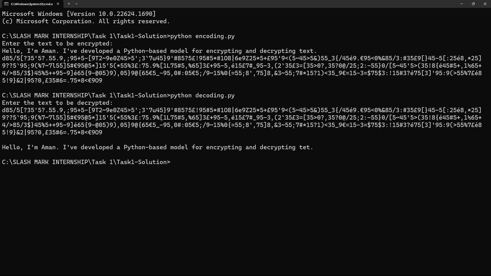

# Encryption and Decryption Model

This Python script allows you to encrypt and decrypt text using a custom encryption algorithm.

## Encryption

The encryption algorithm used in this model is based on character substitution and randomization. Here's how the encryption process works:

1. Characters are replaced according to predefined mappings:
   - Lowercase letters are substituted with special characters.
   - Uppercase letters are substituted with lowercase letters.
   - Special characters are substituted with digits.
   - Digits are substituted with special characters.

2. Random characters and digits are inserted between the substituted characters for additional randomness.

To encrypt text:
- Run the script and provide the text to be encrypted.
- The encrypted text will be displayed as output.

## Decryption

The decryption algorithm reverses the process of encryption and reconstructs the original text. Here's how decryption works:

1. The encrypted text is analyzed to identify the substituted characters and their positions.
2. Characters are restored based on the reverse mappings of the encryption process.
3. Random characters and digits inserted during encryption are removed.

To decrypt text:
- Run the script and provide the encrypted text.
- The decrypted text will be displayed as output.

## Usage

1. Run the encryption script:

    ```bash
    python encryption.py
    ```

2. Enter the text to be encrypted when prompted.

3. The encrypted text will be displayed.

4. Run the decryption script:

    ```bash
    python decryption.py
    ```

5. Enter the encrypted text when prompted.

6. The decrypted text will be displayed.
   
## Output


